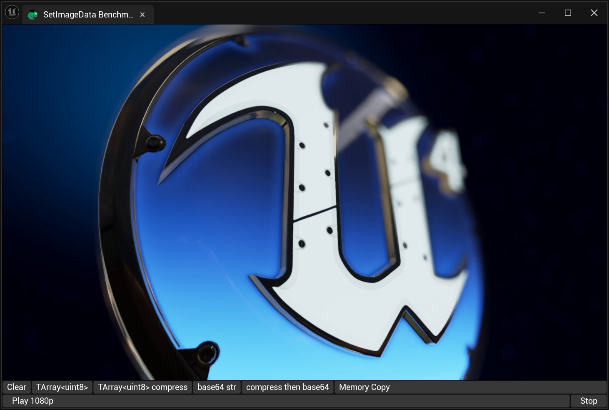
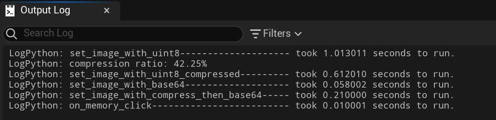

This tool will be used to demonstrate the new (**fast**) way of filling the content of SImage components:



- unreal.ChameleonData.set_image_data_base64 
- unreal.ChameleonData.set_image_data_from_memory


And `set_image_data_from_memory` is 70-100 times faster than the previous method `set_image_data`. Currently, this method is sufficient to support the playback of 1080p video streams. This is very helpful for tools that need to dynamically update the screen content, such as [TAPython_Taichi_StableFluid_UE5](


## Time consumption
|        | set_image_data   |set_image_data compressed |set_image_data_base64 |set_image_data_base64 compressed  |set_image_data_from_memory|
|  ----  |  ----    | ----    |  ----  | ----  | ----  |
|ms      | 1013.011 | 612.010 | 58.002 |210.0 |10.001 |
|note    |          | compression ratio 42.25% |  || Best |




## Requirement 
[TAPython v.1.2.1b](https://github.com/cgerchenhp/UE_TAPython_Plugin_Release/releases/tag/v1.2.1b-ue5.3.0)


### python 3rd party library

```
opencv-python
Pillow
numpy
```

## How to use


Add the following content to "OnToolbarMenu" in MenuConfig.json


```JSON
    {
        "name": "Set SImage Data",
        "ChameleonTools": "../Python/set_image_data_test/set_image_test.json",
    }
    ...
```

Or open the tool with the following command in the Python command line

```Python
unreal.ChameleonData.launch_chameleon_tool("../Python/set_image_data_test/set_image_test.json")
```

## How it works

In Python, whether OpenCV (cv2) or PIL, the image is in the form of numpy.ndarray. And the ctypes.data attribute of the ndarray object is a pointer to the array data. This pointer can be passed to C or C++ functions.


For example, in the following code, we pass the memory address uint64 (im.ctypes.data) and the data length (size) to c++. Thus, the amount of data transmission of large images is reduced to the lowest level.

```Python
    @timeit
    def on_memory_click(self):
        im = self.im
        # im = np.ascontiguousarray(im, dtype=np.uint8)
        size = self.w * self.h * self.channel
        self.data.set_image_data_from_memory(self.ui_image_name, im.ctypes.data, size, self.w, self.h, self.channel, True)
```

This method has also become the current best practice, speeding up 101 times. (1013.011ms -> 10.001ms)


```c++
UFUNCTION(BlueprintCallable, Category = Scripting)
void SetImageDataFromMemory(FName AkaName, const int64& Address, const int64& Length, int32 Width, int32 Height, int32 ChannelNum = 4, bool bBGR = true);
```

```Python
    @timeit
    def on_memory_click(self):
        im = self.im
        # im = np.ascontiguousarray(im, dtype=np.uint8)
        size = self.w * self.h * self.channel
        self.data.set_image_data_from_memory(self.ui_image_name, im.ctypes.data, size, self.w, self.h, self.channel, True)
```

Of course, we need to pay attention to the legality of the address and the continuity of the memory. In many operations of numpy, the actual data in data will not be modified. Therefore, when we do some operations on the image, such as rotation, clipping, scaling, etc., we need to call `np.ascontiguousarray` to ensure the continuity of the memory.


```Python
    @timeit
    def on_memory_click(self):
        im = self.im
        im = np.ascontiguousarray(im, dtype=np.uint8)
        size = self.w * self.h * self.channel
        self.data.set_image_data_from_memory(self.ui_image_name, im.ctypes.data, size, self.w, self.h, self.channel, True)
```

And besides images, other large data can also be transmitted in a similar way through ctypes.


